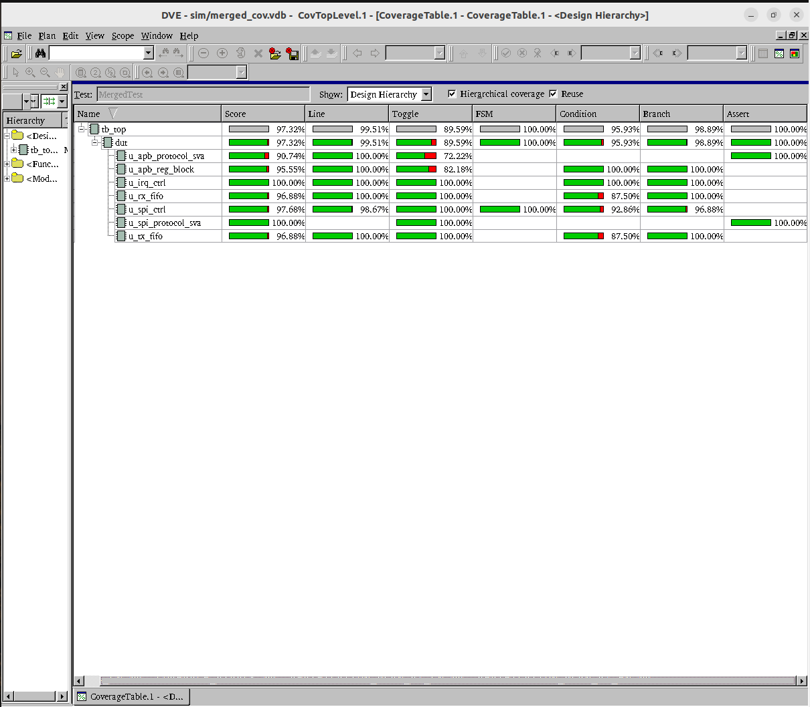
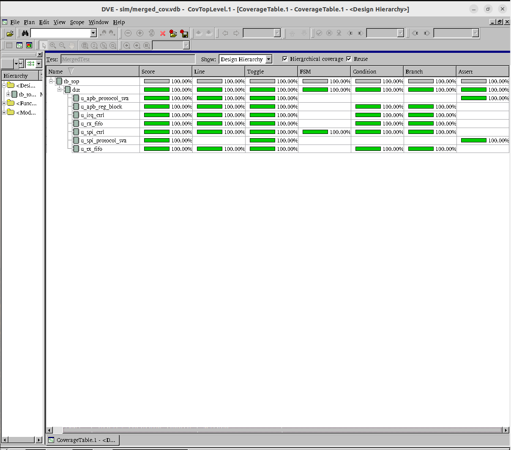

# APB3 SPI Master Controller

**English** | [简体中文](README_CN.md)

An APB3-style SPI master controller with synthesizable SystemVerilog RTL and a UVM verification environment.

## Highlights

- Always-ready 32-bit APB register interface with PSLVERR on illegal accesses
- SPI modes 0–3, fixed 8-bit frames, MSB first
- Programmable clock divider and automatic chip-select control
- Independent 8-entry TX and RX FIFOs
- Single-frame and continuous-transfer modes
- Raw, masked, level-triggered, and sticky interrupt handling
- Hardware and software reset support
- UVM agents, RAL model, scoreboard, functional coverage, and SVA

## Verification

18 directed + constrained-random tests covering all 28 spec-derived features.
Two-tier regression (normal + protocol-negative corner), 18/18 pass under ASSERT=1.

| Raw coverage | Waived coverage |
|---|---|
|  |  |

- **Functional coverage**: 4 covergroups (cfg, fifo, irq, frame) — P0/P1 100%
- **Code coverage** (DUT only): SCORE 95.53, LINE 99.51, COND 91.87, FSM 100, BRANCH 98.89
- **Waiver artifacts**: vtrack, YAML waiver source, DVE `.el` exclusion file

## Repository Layout

```text
rtl/          Synthesizable RTL and design specifications
tb/           UVM testbench, tests, sequences, RAL, coverage, and assertions
tb/doc/       Verification plan, vtrack, waiver files, coverage figures
```

## Quick Start

The supplied flow uses Synopsys VCS with UVM 1.2. Run commands from the repository root:

```bash
# Build and run the smoke test
make -C tb sim TESTNAME=smoke_test SEED=1

# Run the normal regression suite
make -C tb normal_regression

# Run the full regression suite (normal + corner)
make -C tb all_regression

# Remove all generated simulation files
make -C tb clean_all
```

Useful options include `COV=0`, `FSDB=0`, `ASSERT=0`, `DEBUG=1`, and `VERB=UVM_HIGH`.

## Documentation

- [Design specification — English](rtl/doc/apb_spi_master_controller_v1_spec_en.md)
- [Design specification — 中文](rtl/doc/apb_spi_master_controller_v1_spec_cn.md)
- [Verification plan — English](tb/doc/VERIFICATION_PLAN_V1_EN.md)
- [Verification plan — 中文](tb/doc/VERIFICATION_PLAN_V1_CN.md)
- [Coverage tracking — English](tb/doc/COVERAGE_VTRACK.md)
- [Coverage tracking — 中文](tb/doc/COVERAGE_VTRACK_CN.md)

## License

This project is released under the [MIT License](LICENSE).
